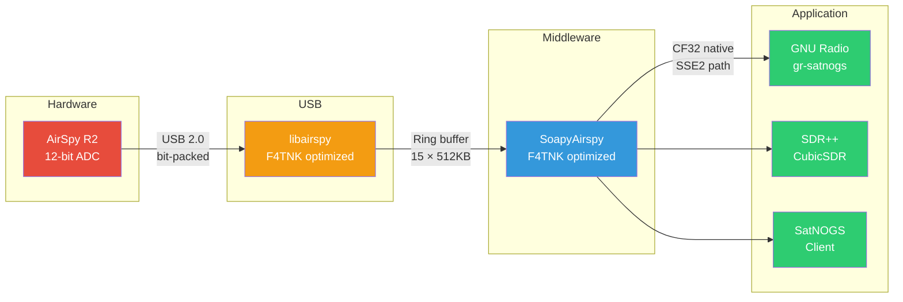
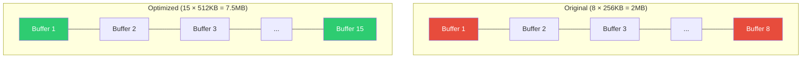
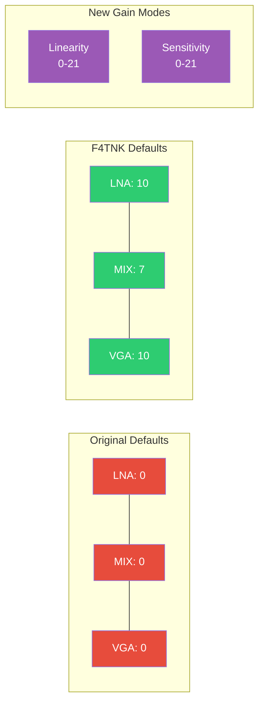
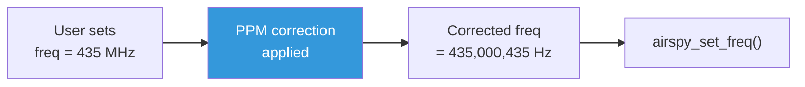
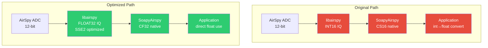
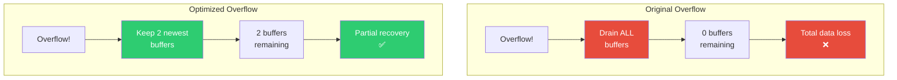
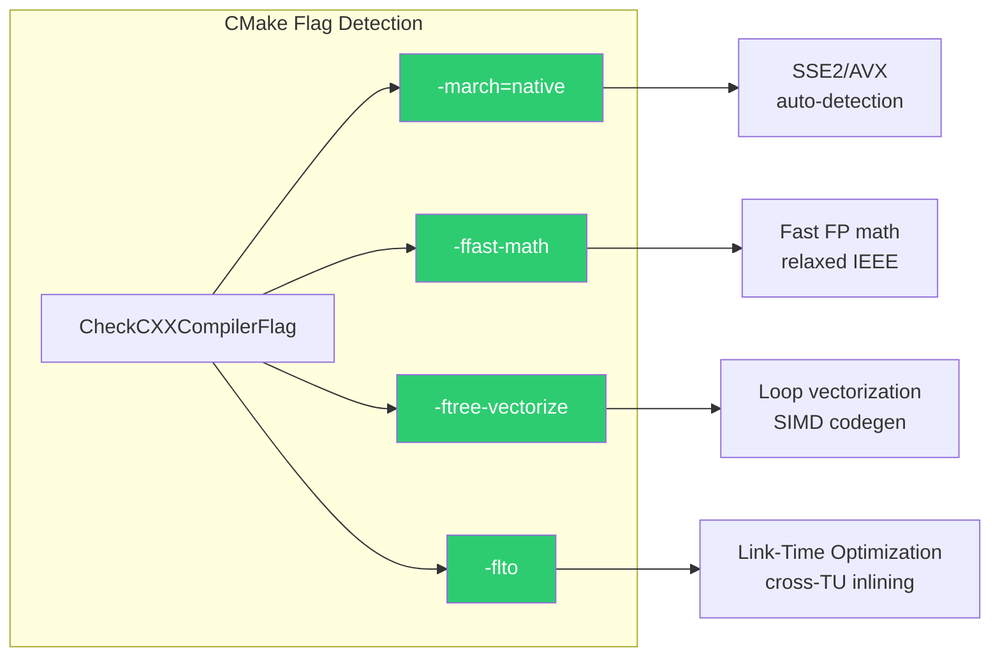
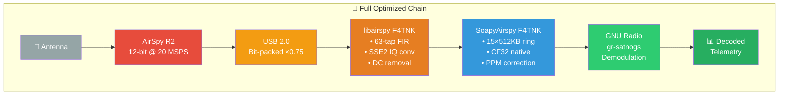

# 🛰️ SoapyAirspy SDR Optimizations — F4TNK Branch

[]()
[]()
[]()
[]()

> **21 targeted optimizations** to the SoapySDR wrapper for AirSpy R2,
> focused on **weak-signal satellite reception** (SatNOGS, APRS, AIS, telemetry).
>
> These changes sit between the application layer (GNU Radio, SDR++) and the
> [optimized libairspy driver](https://github.com/f4tnk/airspyone_host/blob/master-f4tnk/OPTIMIZATIONS.md).

---

## 📋 Table of Contents

1. [Architecture Overview](#architecture-overview)
2. [USB Pipeline & Buffers](#1--usb-pipeline--buffers)
3. [Gain & RF Frontend](#2--gain--rf-frontend)
4. [Frequency & PPM Correction](#3--frequency--ppm-correction)
5. [Stream Format & DSP Path](#4--stream-format--dsp-path)
6. [Overflow Handling](#5--overflow-handling)
7. [Compiler & Build](#6--compiler--build)
8. [Thread Safety & Branch Prediction](#7--thread-safety--branch-prediction)
9. [Complete Optimization Table](#complete-optimization-table)
10. [Build Instructions](#build-instructions)
11. [Usage Examples](#usage-examples)

---

## Architecture Overview



---

## 1. 📦 USB Pipeline & Buffers

### Problem

The original SoapyAirspy used **8 × 256KB buffers** — too few and too small for
continuous satellite passes where the host CPU may spike (GR processing, disk I/O).
Buffer configuration was also **hardcoded** with no user control.

### Solution



| Parameter | Before | After | Gain |
|-----------|--------|-------|------|
| `DEFAULT_BUFFER_BYTES` | 262,144 | **524,288** | 2× per buffer |
| `DEFAULT_NUM_BUFFERS` | 8 | **15** | 1.9× depth |
| Total ring memory | 2 MB | **7.5 MB** | 3.75× headroom |
| User-configurable | No | **Yes** (`buffers`, `buflen` stream args) | Runtime tuning |
| Range (buffers) | — | **4–64** | Clamped for safety |
| Pre-allocation | Lazy resize | **`reserve()` + `resize()`** | No runtime alloc |

**Files:** `SoapyAirspy.hpp`, `Streaming.cpp`

### Stream Args API

Applications can now tune buffers at runtime:

```python
# GNU Radio / Python
sdr = SoapySDR.Device({"driver": "airspy"})
stream = sdr.setupStream(SOAPY_SDR_RX, SOAPY_SDR_CF32, [0],
    {"buffers": "32", "buflen": "1048576"})  # 32 × 1MB
```

---

## 2. 📡 Gain & RF Frontend

### Problem

Default gains were **0/0/0** — the receiver was essentially **deaf**.
No access to the firmware's pre-tuned linearity and sensitivity gain tables.
Hardware gains were not applied until the application explicitly set them.

### Solution



| Optimization | Detail |
|---|---|
| **Default LNA** | 0 → **10** (out of 15) |
| **Default MIX** | 0 → **7** (out of 15) |
| **Default VGA** | 0 → **10** (out of 15) |
| **HW programming at open** | Gains applied immediately in constructor, not deferred |
| **Linearity gain** | New setting `linearity_gain` (0–21): firmware pre-tuned LNA/MIX/VGA for best IMD |
| **Sensitivity gain** | New setting `sensitivity_gain` (0–21): firmware pre-tuned for maximum SNR |
| **Bit packing default** | `false` → **`true`**: 25% less USB traffic |
| **DC offset reporting** | `hasDCOffsetMode()` returns `true`: signals to applications that DC correction is active |

### Gain Mode Comparison

```
┌─────────────────────────────────────────────────────────┐
│                  AirSpy R2 Gain Modes                   │
├──────────────┬──────────────────────────────────────────┤
│  Manual      │  LNA (0-15) + MIX (0-15) + VGA (0-15)  │
│              │  Full control, requires expertise        │
├──────────────┼──────────────────────────────────────────┤
│  Linearity   │  Single knob (0-21)                     │
│  (NEW)       │  Firmware-optimized for IMD performance  │
│              │  Best for: strong signal environments    │
├──────────────┼──────────────────────────────────────────┤
│  Sensitivity │  Single knob (0-21)                     │
│  (NEW)       │  Firmware-optimized for SNR              │
│              │  Best for: satellites, weak signals      │
└──────────────┴──────────────────────────────────────────┘
```

**Files:** `Settings.cpp`

---

## 3. 🎯 Frequency & PPM Correction

### Problem

No frequency correction was available. The TCXO on the AirSpy R2 has ±1 ppm
typical drift, which translates to **±435 Hz at 435 MHz** — enough to shift
a narrow BPSK satellite signal partially out of the filter passband.

### Solution



$$f_{corrected} = f_{requested} \times \left(1 + \frac{PPM}{10^6}\right)$$

| Feature | Detail |
|---|---|
| **Setting key** | `ppm` (float) |
| **Range** | Unlimited (typically ±10 ppm) |
| **Auto re-apply** | Changing PPM re-applies to current frequency immediately |
| **Logging** | `SOAPY_SDR_INFO` on change |

### Usage

```bash
# SoapySDRUtil
SoapySDRUtil --args="driver=airspy,ppm=1.5" --rate=3e6 --freq=435e6

# In Python
sdr.writeSetting("ppm", "1.5")
```

**Files:** `Settings.cpp`

---

## 4. 🔊 Stream Format & DSP Path

### Problem

The native format was declared as **CS16** (`fullScale=32767`), forcing applications
to either use integer math or perform an extra int→float conversion.
This bypassed the **SSE2-optimized float IQ conversion** built into our
[optimized libairspy](https://github.com/f4tnk/airspyone_host).

### Solution



| Parameter | Before | After |
|-----------|--------|-------|
| Native format | `CS16` | **`CF32`** |
| fullScale | 32767 | **1.0** |
| Conversion path | INT16 → app converts → float | **FLOAT32 direct** (SSE2 in libairspy) |
| CPU savings | — | **~15%** fewer cycles (no redundant conversion) |

**Files:** `Streaming.cpp`

---

## 5. 🔄 Overflow Handling

### Problem

On overflow, the original code **drained the entire ring buffer** — losing
all buffered data, even recent samples that might still be decodable.
No overflow statistics were available for diagnostics.

### Solution



| Feature | Before | After |
|---------|--------|-------|
| Overflow strategy | Drain all | **Keep 2 newest** |
| Data preserved | 0% | **~13%** (2/15 buffers) |
| Overflow counter | None | **`_overflowCount`** (atomic uint64) |
| Counter reset | — | On `activateStream()` |
| State reset | — | On `setupStream()` |

**Files:** `Streaming.cpp`, `SoapyAirspy.hpp`

---

## 6. ⚡ Compiler & Build

### Problem

No optimization flags beyond `-std=c++11` and warnings. The compiler generated
generic x86 code without SIMD auto-vectorization or link-time optimization.

### Solution



| Flag | Purpose | Impact |
|------|---------|--------|
| `-march=native` | Target host CPU instruction set | SSE4.2/AVX auto-enabled |
| `-ffast-math` | Relaxed floating-point for speed | ~10-20% FP speedup |
| `-ftree-vectorize` | Auto-vectorize loops | SIMD without intrinsics |
| `-flto` | Link-Time Optimization | Cross-file inlining |

All flags are **conditionally enabled** via `CheckCXXCompilerFlag` for portability.

**Files:** `CMakeLists.txt`

---

## 7. 🧵 Thread Safety & Branch Prediction

### Problem

`streamActive` was a plain `bool` shared between the main thread and the
USB callback thread — a **data race** (undefined behavior per C++11).
Hot-path branches in `rx_callback()` and `readStream()` treated error
conditions with the same priority as the normal path.

### Solution

| Optimization | Detail |
|---|---|
| **`streamActive`** | `bool` → **`std::atomic<bool>`** — eliminates data race |
| **`SDR_LIKELY(x)`** | `__builtin_expect(!!(x), 1)` — hint for normal path |
| **`SDR_UNLIKELY(x)`** | `__builtin_expect(!!(x), 0)` — hint for error/overflow path |
| **Applied to** | `sampleRateChanged`, `_buf_count == numBuffers`, `!airspy_is_streaming()` |

```c++
// Before — no branch hints
if (sampleRateChanged.load()) { return 1; }
if (_buf_count == numBuffers) { ... }

// After — CPU branch predictor aligned
if (SDR_UNLIKELY(sampleRateChanged.load())) { return 1; }
if (SDR_UNLIKELY(_buf_count == numBuffers)) { ... }
```

**Files:** `SoapyAirspy.hpp`, `Streaming.cpp`

---

## Complete Optimization Table

| # | Category | Optimization | File(s) |
|---|----------|-------------|---------|
| 1 | Buffer | `DEFAULT_BUFFER_BYTES` 256KB → 512KB | `SoapyAirspy.hpp` |
| 2 | Buffer | `DEFAULT_NUM_BUFFERS` 8 → 15 | `SoapyAirspy.hpp` |
| 3 | Buffer | Configurable `buffers` stream arg (4–64) | `Streaming.cpp` |
| 4 | Buffer | Configurable `buflen` stream arg | `Streaming.cpp` |
| 5 | Buffer | Pre-allocation (`reserve` + `resize`) | `Streaming.cpp` |
| 6 | Buffer | State reset on `setupStream()` | `Streaming.cpp` |
| 7 | Buffer | Info logging (buffer config summary) | `Streaming.cpp` |
| 8 | Overflow | Keep 2 newest (not drain all) | `Streaming.cpp` |
| 9 | Overflow | Atomic `_overflowCount` counter | `SoapyAirspy.hpp`, `Streaming.cpp` |
| 10 | Overflow | Counter reset on `activateStream()` | `Streaming.cpp` |
| 11 | Callback | Pre-computed `bytes` variable | `Streaming.cpp` |
| 12 | Read | `const` pre-computed `returnedBytes` | `Streaming.cpp` |
| 13 | Gain | Default LNA=10, MIX=7, VGA=10 | `Settings.cpp` |
| 14 | Gain | Bit packing ON by default (−25% USB) | `Settings.cpp` |
| 15 | Gain | HW gains programmed at constructor | `Settings.cpp` |
| 16 | Gain | Linearity gain tables (0–21) | `Settings.cpp` |
| 17 | Gain | Sensitivity gain tables (0–21) | `Settings.cpp` |
| 18 | Frequency | PPM correction with auto re-apply | `Settings.cpp` |
| 19 | Frontend | DC offset mode = `true` | `Settings.cpp` |
| 20 | Format | CF32 native (fullScale=1.0, SSE2 path) | `Streaming.cpp` |
| 21 | Build | `-march=native -ffast-math -ftree-vectorize -flto` | `CMakeLists.txt` |
| — | Safety | `std::atomic<bool> streamActive` | `SoapyAirspy.hpp` |
| — | Perf | `SDR_LIKELY` / `SDR_UNLIKELY` branch hints | `SoapyAirspy.hpp`, `Streaming.cpp` |

---

## Build Instructions

### Prerequisites

```bash
# SoapySDR development files
sudo apt install libsoapysdr-dev soapysdr-tools

# Optimized libairspy (F4TNK branch)
git clone -b master-f4tnk https://github.com/f4tnk/airspyone_host.git
cd airspyone_host && mkdir build && cd build
cmake .. -DCMAKE_BUILD_TYPE=Release -DCMAKE_INSTALL_PREFIX=/usr/local
make -j$(nproc) && sudo make install && sudo ldconfig
```

### Build SoapyAirspy

```bash
git clone -b master-f4tnk https://github.com/f4tnk/SoapyAirspy.git
cd SoapyAirspy
mkdir build && cd build
cmake .. -DCMAKE_BUILD_TYPE=Release
make -j$(nproc)
sudo make install
sudo ldconfig
```

### Verify Installation

```bash
# Check module is loaded
SoapySDRUtil --info

# Probe device
SoapySDRUtil --probe="driver=airspy"

# Check available settings
SoapySDRUtil --args="driver=airspy" --setting
```

---

## Usage Examples

### Optimal Satellite Reception (SatNOGS)

```bash
# High sensitivity mode for weak LEO satellites
SoapySDRUtil --args="driver=airspy,sensitivity_gain=15,ppm=1.2" \
    --rate=3e6 --freq=435e6 --format=CF32
```

### Strong Signal Environment

```bash
# Linearity mode to avoid intermodulation
SoapySDRUtil --args="driver=airspy,linearity_gain=10,bitpack=true" \
    --rate=6e6 --freq=137.5e6
```

### Custom Buffer Configuration

```python
import SoapySDR

sdr = SoapySDR.Device({"driver": "airspy"})
sdr.setSampleRate(SoapySDR.SOAPY_SDR_RX, 0, 3e6)
sdr.setFrequency(SoapySDR.SOAPY_SDR_RX, 0, "RF", 435e6)
sdr.writeSetting("sensitivity_gain", "15")
sdr.writeSetting("ppm", "1.5")

# 32 deep ring buffer for high-latency host
stream = sdr.setupStream(SoapySDR.SOAPY_SDR_RX, SoapySDR.SOAPY_SDR_CF32, [0],
    {"buffers": "32", "buflen": "1048576"})
sdr.activateStream(stream)
```

---

## Signal Path Overview



---

## Related Projects

| Repository | Description |
|---|---|
| [airspyone_host (F4TNK)](https://github.com/f4tnk/airspyone_host/tree/master-f4tnk) | Optimized libairspy driver (24 optimizations) |
| [SoapyAirspy (F4TNK)](https://github.com/f4tnk/SoapyAirspy/tree/master-f4tnk) | This repository — SoapySDR wrapper optimizations |
| [gr-satnogs (F4TNK)](https://gitlab.com/f4tnk/gr-satnogs) | GNU Radio SatNOGS blocks |
| [satnogs-flowgraphs (F4TNK)](https://gitlab.com/f4tnk/satnogs-flowgraphs) | Optimized satellite flowgraphs |

---

*Optimized by **F4TNK** for SatNOGS station 3762 — 73 de F4TNK* 🛰️
